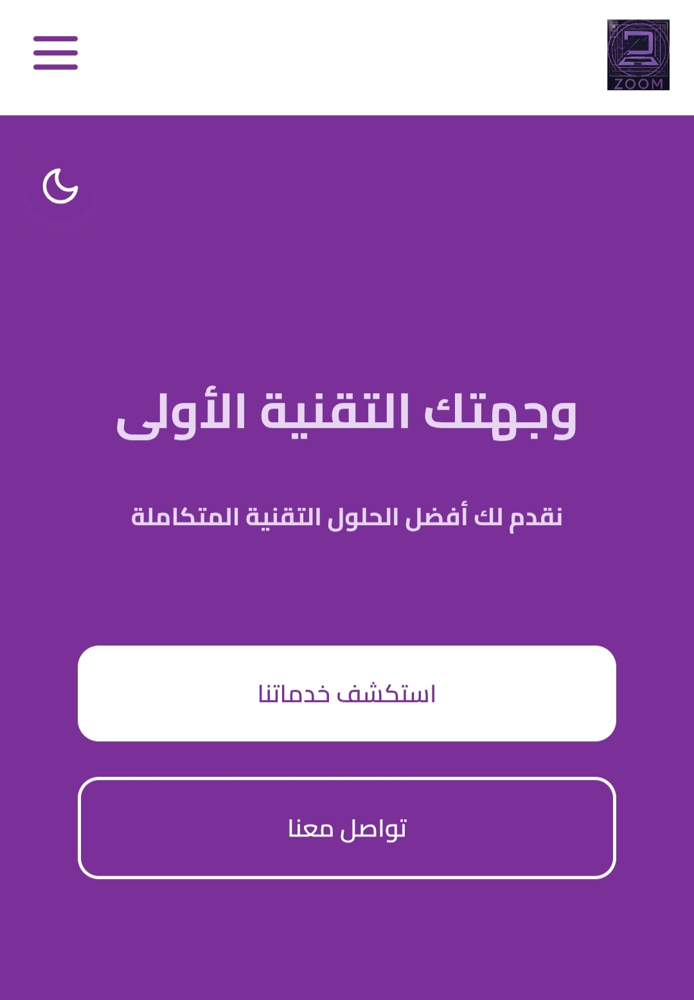

# 💻 Zoom - Laptop Store Website

A modern, responsive landing page designed for a Laptop & Electronics store.  
This project was developed to showcase various laptop models with a sleek and user-friendly interface.

## 🔗 [Live Demo (Click to Visit)](https://zoom-laptop.vercel.app/)

---

### 📸 Screenshots
<!Screenshots screenshot.png -->
 

---

### 🛠️ Technologies Used
*   **HTML5** (Semantic Structure)
*   **CSS3** (Styling, Flexbox/Grid, Responsive Design)
*   **JavaScript** (For interactive Note)
*   **Vercel** (Hosting & Deployment)

---

### ✨ Features
*   **Responsive Design:** Works perfectly on Desktop, Tablet, and Mobile.
*   **Modern UI:** Dark theme with clean typography.
*   **Product Showcase:** Grid layout to display laptop details clearly.
*   **Contact/Location:** Sections for user engagement.

---

### 👨‍💻 Author
**Aubai**  
ICT Engineering Student & Front-End Developer.
